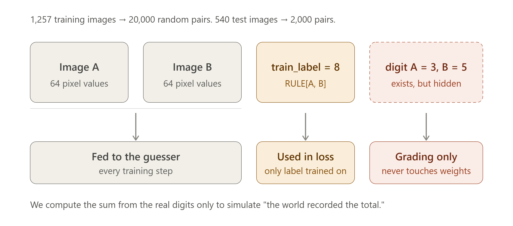
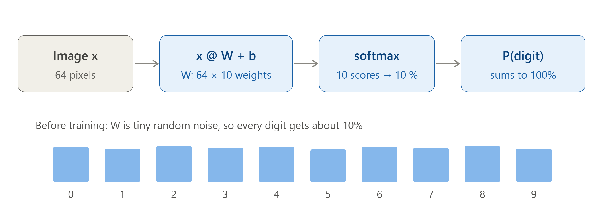
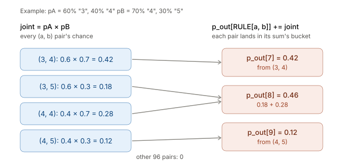
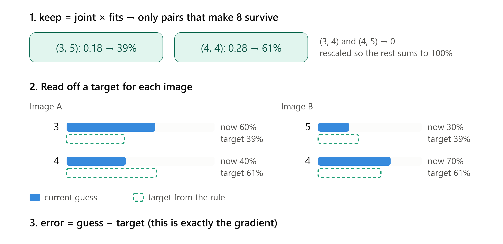
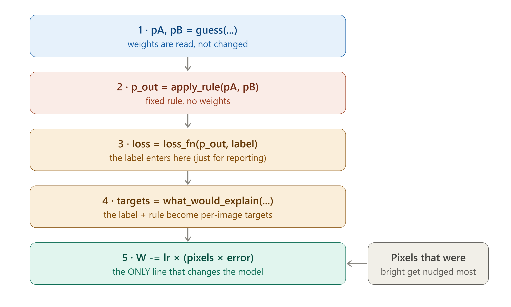

# Using Addition to Learn Digits

**Teaching a model to read handwritten digits without ever telling it what any digit is: only what pairs of digits add up to.**

> We have a pile of images of numbers, but we've lost the knowledge of how to read them. Thankfully, someone kept the rules of addition and a record of what each *pair* of images summed to.
> Can we re-learn how to read the numbers from that alone?

Yes. A plain one-layer classifier trained only on sums reads individual digits with **97.6%** accuracy. That's slightly *better* than the same model trained directly on the real digit labels (97.0%).

This is a small, from-scratch example of **neurosymbolic learning**: a neural part (pixels → digit guesses) learns under supervision from a symbolic part (a fixed, known rule: `sum = a + b`).

---

## Results

| Model | Labels it trained on | Hidden digit accuracy (test) |
|---|---|---|
| **This notebook**: softmax classifier + addition rule | sum of two images only | **97.6%** |
| Same 1-layer model (`LogisticRegression`) | the real digit of every image | 97.0% |

The model also predicts the **sum** of held-out test pairs correctly **95.0%** of the time. That's expected to be lower than digit accuracy, since a pair is right only when both digits are.

Training progress (hidden digit accuracy is measured for grading only; it never feeds back into training):

```
epoch 1: loss 0.239, hidden digit accuracy 96.9%
epoch 2: loss 0.140, hidden digit accuracy 97.2%
epoch 3: loss 0.103, hidden digit accuracy 97.4%
```

---

## The setup

- **Images:** scikit-learn's `load_digits`, 1,797 handwritten digits at 8×8 pixels, scaled to 0–1. The split is 70/30, stratified: 1,257 training images and 540 test images.
- **Pairs:** 20,000 random training pairs and 2,000 test pairs.
- **The only training label:** `RULE[digit_A, digit_B]`, the sum (0–18). The real digits are used once, to simulate "the world recorded the total", and then hidden from training.



The symbolic knowledge is one table, which is the whole ontology the model gets:

```python
RULE = np.add.outer(np.arange(10), np.arange(10))   # RULE[a, b] = a + b
N_OUTCOMES = RULE.max() + 1                         # 19 possible sums
```

---

## How it works

### 1. The guesser: pixels → digit probabilities

A single linear layer plus softmax: `P(digit | image) = softmax(x @ W + b)`, with `W` holding 64 × 10 weights. Before training, `W` is tiny random noise, so every digit gets about 10%.



### 2. Apply the rule: digit guesses → sum guesses

Multiply the two images' guesses to get the chance of every `(a, b)` pair. Then pour each pair's chance into the bucket for its sum, `RULE[a, b]`.



```python
pA = 60% "3", 40% "4"     pB = 70% "4", 30% "5"
apply_rule(pA, pB)[7:10]  # -> [0.42, 0.46, 0.12] for sums 7, 8, 9
```

### 3. Score it

The loss is the negative log-probability the rule assigns to the recorded sum: `-log P(sum = label)`.

### 4. Work backwards: what *would* have explained the label?

Keep only the digit pairs that actually produce the labelled sum, rescale them to 100%, and read off a **target** distribution for each image. If the label is 8, then `(3, 5)` and `(4, 4)` survive, and `(3, 4)` and `(4, 5)` are ruled out.



The error `guess − target` is **exactly the gradient** of the loss with respect to each image's softmax scores. So no autograd library is needed; the update is a few lines of NumPy.

### 5. Update the weights

```python
def train_step(model, xA, xB, label, lr=0.5):
    pA, pB = model_predict(model, xA), model_predict(model, xB)  # 1. guess
    p_out = apply_rule(pA, pB)                                   # 2. apply the rule
    loss = loss_fn(p_out, label)                                 # 3. score against the label
    targetA, targetB = what_would_explain(pA, pB, label)         # 4. work out the targets
    n = len(label)
    errA, errB = (pA - targetA) / n, (pB - targetB) / n          # how far off each guess is
    model["W"] -= lr * (xA.T @ errA + xB.T @ errB)               # 5. update weights
    model["b"] -= lr * (errA.sum(axis=0) + errB.sum(axis=0))
    return loss
```



Training runs 3 epochs over the 20,000 pairs in batches of 32, with a learning rate of 0.5.

### Why does this work at all?

Some sums are unambiguous. A sum of **0** can only be `0 + 0`, and **18** can only be `9 + 9`; 1 and 17 are nearly as tight. These easy cases anchor the guesser on a few digits. Once it reads those confidently, they disambiguate harder pairs: if one image is clearly a 0 and the sum is 7, the other must be a 7. Confidence spreads from the anchors to the rest of the digits.

---

## Interactive: Train Step Inspector

Open **[`Train Step Inspector.html`](Train%20Step%20Inspector.html)** in a browser. It works offline, with no install. It runs the exact same `train_step` in JavaScript on 300 real training digits and 150 test digits, and lets you:

- step through training one batch of 32 pairs at a time, or press play
- click any pair to see its two images, its sum label, and the hidden digits
- compare each image's current guess to the target the rule derived for it
- watch the 10 columns of `W` turn from noise into recognisable digit templates, plus the per-step `ΔW`
- track per-digit accuracy, a confusion matrix, and overall hidden digit accuracy as it learns

---

## Beyond MNIST: a real-world analogue

The notebook also maps the same pattern onto **classifying bank transactions using only the running balance**:

| Digit addition | Transaction categorisation |
|---|---|
| Image A, Image B | Transaction text, amount |
| Hidden digit (0–9) | Hidden category (deposit, purchase, fee, …) |
| Sum label | The posted running balance |
| `sum = a + b` | `balance[t] = balance[t-1] + signed_amount(category[t])` |
| Hidden digit accuracy | Category accuracy on a small hand-labelled sample |

It also covers where that version is harder:
- **The rule has a weak spot:** transfers can go either way, so the balance alone doesn't pin them down.
- **The data is noisy:** reversals and posting lags mean the loss needs some tolerance.
- **Shortcuts are a real risk:** a model can reconcile balances using the sign alone, without reading the merchant text.

---

## Running it

From the project root (`C:\dev\neurosymbolic_ai`), using the existing virtual environment:

```powershell
.venv\Scripts\python -m pip install numpy scikit-learn matplotlib jupyter   # already installed
.venv\Scripts\python -m jupyter lab "Using Addition to learn Digits\digital_classifier_symbolic_arithmetic.ipynb"
```

Or open the notebook in VS Code and select `.venv\Scripts\python.exe` as the kernel. Run all cells top to bottom; training takes a few seconds on CPU. Results are reproducible because the code uses `rng = np.random.default_rng(0)`.

## Files

| File | What it is |
|---|---|
| `digital_classifier_symbolic_arithmetic.ipynb` | The full walkthrough: data, rule, guesser, `apply_rule`, loss, targets, training, evaluation |
| `Train Step Inspector.html` | Self-contained interactive visualisation of `train_step` |
| `cell2_…png` … `cell7_…png`, `cell4_…svg` | Diagrams for each stage of the notebook (used above) |
| `data/mnist/` | Raw 28×28 MNIST files from an earlier version of the notebook; the current notebook uses the 8×8 `load_digits` set instead |
