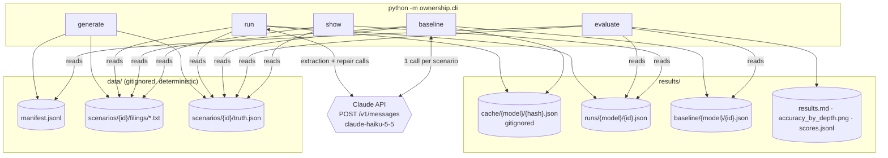
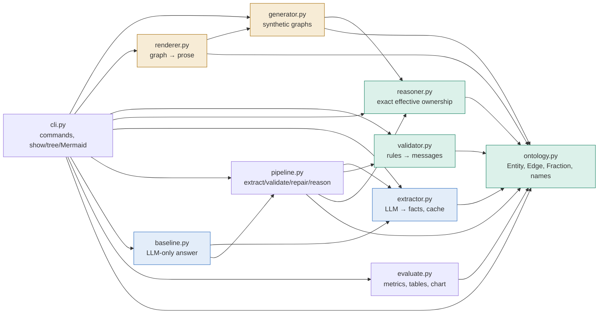
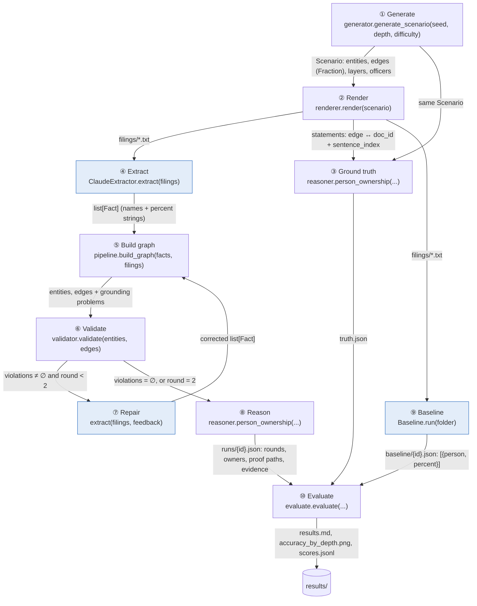
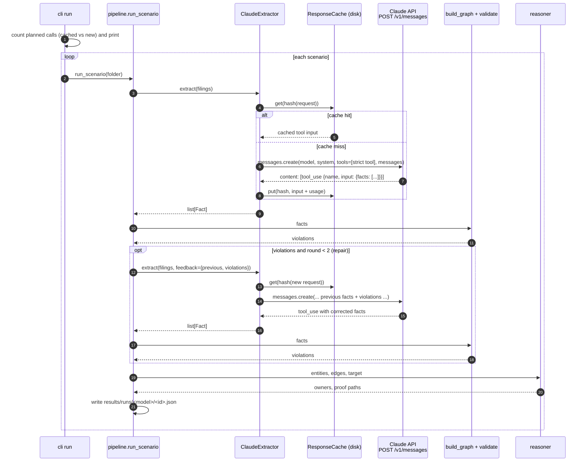
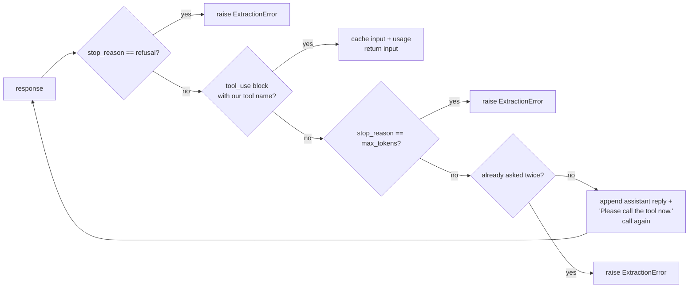
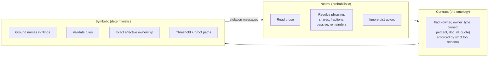

# Architecture and data flow

This document shows how the system is put together: the components, what each processing step does, the shape of the data between steps, the files written to disk, and exactly when and how the Claude API is called.

- For *why* it's designed this way, see [METHODOLOGY.md](METHODOLOGY.md).
- For how to run it, see the [README](README.md).

---

## 1. System overview

Everything is driven by five CLI commands. The first builds data; the next two call the API; the last two only read files.



| Command | Calls the API? | Reads | Writes |
|---|---|---|---|
| `generate --n 64 --seed 0` | no | nothing | `data/` |
| `run --model M` | yes: 1–3 calls per scenario | filings, target name from `truth.json` | `results/runs/`, `results/cache/` |
| `baseline --model M` | yes: 1 call per scenario | filings, target name from `truth.json` | `results/baseline/`, `results/cache/` |
| `evaluate` | no | `data/`, `results/runs/`, `results/baseline/` | `results/results.md`, `.png`, `scores.jsonl` |
| `show <id>` | no | one scenario's files and run log | stdout |

---

## 2. Components

Ten modules, each with one job. Arrows point from a module to the modules it imports.



<sub>Blue = neural (calls the LLM) · green = symbolic (exact rules and maths) · amber = synthetic data.</sub>

| Module | Responsibility | Key functions |
|---|---|---|
| `ontology.py` | The fixed schema. Exact percent helpers, name normalisation, JSON (de)serialisation. | `Entity`, `Edge`, `Evidence`, `pct`, `fmt_pct`, `normalize_name` |
| `generator.py` | Builds a layered ownership graph per seed and plants one interesting owner. | `generate_scenario`, `flags`, `longest_chain` |
| `renderer.py` | Writes 1–3 prose filings and records the sentence each edge is stated in. | `render`, `shares_for`, `percent_from_shares` |
| `extractor.py` | Sends filings to the LLM with a strict tool; parses facts; caches responses. | `ClaudeExtractor`, `ClaudeToolCaller`, `ResponseCache`, `OllamaExtractor`, `FakeExtractor` |
| `validator.py` | Checks a graph against the ontology rules; returns repair instructions. | `validate` |
| `reasoner.py` | Effective ownership by path enumeration and by `(I − O)⁻¹ − I`. | `effective_ownership`, `total_ownership_matrix`, `beneficial_owners` |
| `pipeline.py` | Orchestrates one scenario: extract → build graph → validate → repair → reason. | `run_scenario`, `build_graph`, `format_run` |
| `baseline.py` | Asks the same model for the final answer directly. | `Baseline.run` |
| `evaluate.py` | Scores both methods against the truth; writes tables and the chart. | `evaluate`, `edge_scores`, `answer_scores` |
| `cli.py` | Commands; builds `truth.json`; prints trees and Mermaid diagrams. | `cmd_generate`, `cmd_run`, `cmd_show`, … |

---

## 3. End-to-end data flow

Each box is a processing step; each arrow is labelled with the data that moves along it.



<sub>Blue steps make Claude API calls. Everything else is local and deterministic.</sub>

---

## 4. Step by step

Each step below lists what it does, what goes in and what comes out, with real data from scenario `d3_hard_00`.

### ① Generate: `generator.generate_scenario`

**What it does**
1. Seeds `random.Random(seed)`, so the same seed always gives the same scenario.
2. Creates the target (layer 0) and 1–2 holding companies per layer for layers 1 to depth−1.
3. Links each holding company to one company in the layer below, which creates the chain. Sometimes it adds a second stake that skips a layer.
4. Adds the first person, who owns a top-layer company. That guarantees a chain of exactly `depth` hops.
5. **Plants** one owner. It computes each company's effective share of the target, solves `stake = wanted ÷ share`, adds the stake and re-measures the result.
6. Adds 1–3 filler owners and 2–3 directors or officers who own nothing.

**Invariant:** each company keeps a running "free" percent, so its stakes can never total more than 100%. 30% of the target is reserved until the planted owner has been placed.

**Output:** a `Scenario`:
```python
Scenario(id="d3_hard_00", depth=3, difficulty="hard", case="multi_path", target="c0",
         entities={"c0": Entity("c0", "Tidal Crest LLC", "company"), "p1": Entity("p1", "Fay Hale", "person"), ...},
         edges=[Edge("c1", "c0", Fraction(40)), Edge("p1", "c1", Fraction(60)), ...],
         officers=[("Milo Hale", "chair of the board", "c0"), ...])
```

### ② Render: `renderer.render`

**What it does**
1. Groups the edges by owned company, then spreads the companies over 1–3 documents.
2. Per company, writes a paragraph with the founding date and an optional address, then a paragraph of ownership sentences in a shuffled order.
3. Picks a template per edge. **Easy** uses direct percents. **Hard** uses passive voice, fractions, share counts, or one remainder sentence covering every owner of a company whose stakes total 100%.
4. Inserts officer sentences at random positions among the ownership sentences.
5. Builds each document as a **list of sentences**, so each statement's `sentence_index` is exact.

**Output:** `list[Document]` and `list[Statement]`:
```python
Statement(doc_id="doc1", sentence_index=2, template="hard_shares",
          text="Amber Meadow Holdings Ltd holds 400 of the 1,000 outstanding shares of Tidal Crest LLC.",
          edges=[Edge("c1", "c0", Fraction(40))])
```

### ③ Ground truth: `cli.build_truth`

**What it does**
1. Attaches each statement's evidence (doc, sentence, quote) to its edge.
2. Runs the reasoner to get every person's exact effective ownership and proof paths.
3. Filters for people at 25% or more.
4. Writes the files.

**Output files**
```
data/scenarios/d3_hard_00/filings/doc1.txt
data/scenarios/d3_hard_00/truth.json
data/manifest.jsonl      ← one line per scenario
```
```json
{"id": "d3_hard_00", "depth": 3, "difficulty": "hard", "case": "multi_path",
 "n_entities": 9, "n_edges": 9, "n_docs": 1,
 "has_multi_path_owner": true, "has_near_threshold_owner": false}
```

Before anything is written, `generate` runs `validate()` on every scenario and stops if any is invalid.

### ④ Extract: `ClaudeExtractor.extract`  ⟵ **API call**

**What it does**
1. Wraps each filing as `<filing doc_id="doc1">…</filing>` and appends the instruction.
2. Builds the request (section 5) and hashes it.
3. If the hash is already in `results/cache/`, it returns the cached answer with **no API call**.
4. Otherwise it calls `client.messages.create(...)` and reads the `tool_use` block's `input`.
5. Parses each `percent` string into an exact `Fraction`. Unparseable values are kept as `None`.

**Output:** `list[Fact]`:
```json
{"owner": "Fay Hale", "owner_type": "person", "owned": "Amber Meadow Holdings Ltd",
 "percent": "60", "doc_id": "doc1",
 "quote": "Amber Meadow Holdings Ltd is three-fifths-owned by Fay Hale."}
```

### ⑤ Build graph: `pipeline.build_graph`

**What it does**
1. Normalises names so "Beta L.L.C." matches "beta llc".
2. Assigns entity ids. The type comes from the facts: anything owned must be a company.
3. **Grounding checks** the validator can't do:
   - a name that appears in no filing;
   - an unreadable percent;
   - the same stake listed twice.

**Output:** `entities: dict[id, Entity]`, `edges: list[Edge]` (each with `Evidence(doc_id, quote)`), and `problems: list[str]`.

### ⑥ Validate: `validator.validate`

**What it does:** checks five rules and returns one plain-English message per violation, each ending with an instruction:

| Rule | Message pattern |
|---|---|
| unknown entity | "A 5% stake refers to unknown entity 'ghost'. Use the exact full name…" |
| self-ownership | "X is listed as owning 5% of itself. An entity cannot own itself; …" |
| person owned | "X is a person and cannot be owned, but is listed as 30% owned by Y. …" |
| 0 < % ≤ 100 | "X's stake in Y is listed as 0%. A stake must be more than 0% and at most 100%; …" |
| total ≤ 100% | "Gamma Inc's listed owners total 130%: Beta LLC 70%, Acme Holdings 60%. Re-read the filings and correct these stakes." |

**Output:** `violations = problems + validate(...)`. If it's empty, go to ⑧. Otherwise go to ⑦, or to ⑧ if two repair rounds have already been used.

### ⑦ Repair: `extract(filings, feedback)`  ⟵ **API call**

**What it does:** sends a new, single-message request containing:
1. the same filings;
2. `<previous_facts>` holding the last extraction as JSON;
3. the violation messages as a bulleted list;
4. "Re-read the filings, fix these problems, and call record_ownership_facts again with the complete corrected list."

Because the message text differs from round 0, it has its own cache key. The result goes back into ⑤, with **at most 2 repair rounds**.

### ⑧ Reason: `reasoner.person_ownership` / `beneficial_owners`

**What it does**
1. Finds the target by its normalised name.
2. **Matrix method:** builds `O`, inverts `I − O` exactly with fractions, and reads every person's total for the target.
3. **Path method:** enumerates every simple path for each person, giving proof paths whose hops carry evidence.
4. Keeps the people at 25% or more.
5. Writes the log.

**Output:** `results/runs/claude-haiku-5-5/d3_hard_00.json`:
```json
{"scenario": "d3_hard_00", "model": "claude-haiku-5-5", "target": "Tidal Crest LLC",
 "rounds": [{"round": 0, "facts": [ ... 9 facts ... ], "violations": []}],
 "valid": true,
 "beneficial_owners": [{"person": "Fay Hale", "percent": "219/8", "display": "27.375%",
   "paths": [{"display": "60% x 40% = 24%", "hops": [
       {"owner": "Fay Hale", "owned": "Amber Meadow Holdings Ltd", "percent": "60", "doc_id": "doc1",
        "quote": "Amber Meadow Holdings Ltd is three-fifths-owned by Fay Hale."}, ...]}, ...]}],
 "effective_ownership": [ ... every person with a non-zero share ... ],
 "error": null}
```

### ⑨ Baseline: `Baseline.run`  ⟵ **API call**

**What it does:** sends the same filings plus one question: "Which individuals own 25% or more of Tidal Crest LLC, directly or indirectly? Give each person's effective percentage." It answers through a strict `report_beneficial_owners` tool. There's no graph, no validation and no repair.

**Output:** `results/baseline/claude-haiku-5-5/d3_hard_00.json`:
```json
{"scenario": "d3_hard_00", "model": "claude-haiku-5-5",
 "owners": [{"person": "Fay Hale", "percent": "27.4"}]}
```

### ⑩ Evaluate: `evaluate.evaluate`

**What it does**
1. For each scenario in the manifest, loads `truth.json`, the run log and the baseline log.
2. **Pipeline extraction:** matches the final round's facts to the true edges on normalised owner and owned names, with the percent within ±0.01 points. Counts precision, recall and F1.
3. **Repair:** counts violations, scenarios invalid at round 0, and scenarios valid at the end.
4. **Answer, for both methods:** exact match of the beneficial-owner set, set F1, and MAE of the effective percent for the true owners.
5. Groups by method × difficulty × depth and writes the outputs.

**Output files**
```
results/scores.jsonl          one row per (scenario, method)
results/results.md            overall, by-depth, and full breakdown tables
results/accuracy_by_depth.png exact match vs depth, one line per method, panel per difficulty
```

---

## 5. API calls in detail

### 5.1 When calls happen



The baseline follows the same cache-then-API path, with exactly one call per scenario and no loop.

### 5.2 The request

Both the extractor and the baseline send one `POST /v1/messages` through the official `anthropic` Python SDK (`ClaudeToolCaller.call`):

```python
client.messages.create(
    model="claude-haiku-5-5",
    max_tokens=16000,
    system=SYSTEM_PROMPT,                  # the extraction rules (or the baseline's one-liner)
    tools=[{
        "name": "record_ownership_facts",  # baseline: "report_beneficial_owners"
        "description": "Record every current ownership stake stated in the filings.",
        "strict": True,                    # the API guarantees input matches the schema
        "input_schema": {                  # additionalProperties: false at every level
            "type": "object", "required": ["facts"],
            "properties": {"facts": {"type": "array", "items": {
                "type": "object",
                "required": ["owner", "owner_type", "owned", "percent", "doc_id", "quote"],
                "properties": {"owner_type": {"type": "string", "enum": ["person", "company"]},
                               "percent": {"type": "string"}, "...": "..."}}}},
        },
    }],
    messages=[{"role": "user", "content": "<filing doc_id=\"doc1\">…</filing>\n\nCall record_ownership_facts …"}],
)
```

| Setting | Value | Why |
|---|---|---|
| Endpoint | `POST https://api.anthropic.com/v1/messages` | one call per extraction / answer |
| Auth | `x-api-key` from `ANTHROPIC_API_KEY`; optional `anthropic-workspace-id` from `ANTHROPIC_WORKSPACE_ID` | the key is never in code; some keys need a workspace header |
| `tool_choice` | not set (`auto`) | forcing a tool returns a 400 on some current models; the prompt says to call it |
| `strict: true` | on the tool | arguments always match the fact schema |
| `percent` type | string | `"100/3"` keeps one-third exact; a JSON number can't |
| Retries | SDK default: 2 retries on 429 / 5xx / connection errors | transient failures don't kill a run |

### 5.3 The response and how it's handled



What's read from the response is `block.input` of the `tool_use` block, already a dict that matches the schema, plus `usage.input_tokens` and `usage.output_tokens`, which are stored in the cache file.

### 5.4 Caching

```
key  = sha256( json.dumps({model, max_tokens, system, tools, messages}, sort_keys=True) )
path = results/cache/<model>/<key>.json
file = {"input": {...tool input...}, "stop_reason": "tool_use", "usage": {"input_tokens": 1212, "output_tokens": 535}}
```

- **Any change** to the model, prompt, tool schema or filings changes the key, so stale answers are never reused.
- Repair requests include the previous facts and violations, so each repair round gets its own key.
- Before any API run, the CLI checks the cache and prints how many calls are new, e.g. *"64 first-pass extraction calls (4 already cached), plus up to 128 repair calls"*.

### 5.5 Call budget for this run

| Command | Formula | This run (64 scenarios) |
|---|---|---|
| `run` | 1 per scenario + up to 2 repairs each | 64 (no repairs were needed): 4 in the smoke test, then 60 |
| `baseline` | 1 per scenario | 64: 4 in the smoke test, then 60 |
| **Total** | | **128 calls**, averaging ~1,240 input and ~770 output tokens each |
| Rerun of everything | | **0 calls**: all served from the cache |

---

## 6. Where the neural/symbolic boundary is



The **only** things that cross the boundary are:
- **neural → symbolic:** facts in the ontology's shape, guaranteed by the strict schema;
- **symbolic → neural:** violation messages written as instructions.

The LLM never does the multiplication, and the code never reads the prose.

---

## 7. Error handling and edge cases

| Situation | Where | What happens |
|---|---|---|
| `ANTHROPIC_API_KEY` missing | `extractor.require_api_key` | the CLI exits with instructions before any request |
| Key not scoped to a workspace | API (400) | set `ANTHROPIC_WORKSPACE_ID`; the client sends the `anthropic-workspace-id` header |
| Model declines (`stop_reason: refusal`) | `ClaudeToolCaller.call` | `ExtractionError` |
| Model answers without calling the tool | `ClaudeToolCaller.call` | asked once more, then `ExtractionError` |
| Output hits `max_tokens` | `ClaudeToolCaller.call` | `ExtractionError` (`max_tokens` is 16,000; a typical answer uses ~770) |
| Unparseable percent ("about half") | `fact_from_json` → `build_graph` | percent is `None`, reported as a problem, sent back for repair |
| Invented or misspelled name | `build_graph` | "'X' does not appear in any filing…", sent back for repair |
| Graph still invalid after 2 repairs | `run_scenario` | reasons over it anyway, logs `"valid": false`, evaluation counts it |
| Target not in extracted facts | `run_scenario` | empty answer, `error` explains why |
| Closed 100% cross-holding loop | `reasoner._invert` | singular matrix, so `ValueError`, logged as `error` |
| Generated scenario breaks a rule | `cmd_generate` | generation stops (never happened; tested) |
