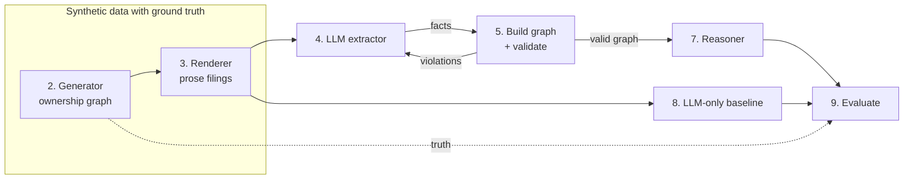

# Methodology walkthrough

This document walks through how the ownership-graph MVP works, in the order the data flows: from a synthetic ownership structure, to prose filings, to LLM extraction, to symbolic checking and reasoning, to evaluation. It follows one real scenario from the dataset (`d3_hard_00`) the whole way through, so every step has concrete numbers.

For setup and commands, see the [README](README.md).

---

## Contents

0. [The problem and the approach](#0-the-problem-and-the-approach)
1. [Fix the ontology first](#1-fix-the-ontology-first)
2. [Generate a structure with known answers](#2-generate-a-structure-with-known-answers)
3. [Render it as prose, keeping an evidence trail](#3-render-it-as-prose-keeping-an-evidence-trail)
4. [Extract facts with the LLM](#4-extract-facts-with-the-llm)
5. [Turn facts into a graph and validate it](#5-turn-facts-into-a-graph-and-validate-it)
6. [Repair: send violations back to the LLM](#6-repair-send-violations-back-to-the-llm)
7. [Reason: compute effective ownership exactly](#7-reason-compute-effective-ownership-exactly)
8. [The LLM-only baseline](#8-the-llm-only-baseline)
9. [Evaluate](#9-evaluate)
10. [What the results do and don't show](#10-what-the-results-do-and-dont-show)

---

## 0. The problem and the approach

**Question:** which individuals own 25% or more of a company, directly or indirectly?

"Indirectly" is the hard part. If Fay owns 60% of Amber Meadow, and Amber Meadow owns 40% of Tidal Crest, Fay effectively owns 60% × 40% = 24% of Tidal Crest. Real structures have several layers and several routes, and the 25% line is a legal threshold, so 24.9% and 25% are different answers.

The information lives in **unstructured prose** (company filings), but the answer needs **exact arithmetic** and a **paper trail**. Those two needs pull in different directions:

| Need | Good at it | Weak at it |
|---|---|---|
| Reading "holds 400 of the 1,000 outstanding shares" or "the remaining interest" | LLMs | hand-written parsers |
| Multiplying through chains exactly; proving where every number came from | symbolic code | LLMs (they round, and they can't show verified working) |

So the work is split. The **neural** half reads the prose and turns it into facts in a fixed format. The **symbolic** half checks those facts against rules, sends problems back to be fixed, and does all the arithmetic. This split is what "neurosymbolic" means here.



To measure whether this helps, we need filings where the right answer is **known exactly**. Real filings don't come with answer keys, so the data is synthetic: we build an ownership structure first, compute the true answer, and only then write the filings that describe it.

---

## 1. Fix the ontology first

Before writing any data or prompts, we fixed the **ontology**: the complete list of things and relations the system is allowed to know about. It's deliberately tiny:

```
Entity   id, name, type ∈ {person, company}
Edge     owner → owned, percent, evidence (doc_id, quote)
```

Everything downstream speaks this language: the generator produces it, the LLM is forced to output it, the validator checks it, and the reasoner computes over it. A fixed ontology is what lets symbolic rules check an LLM's output at all. You can't validate free text, but you can validate "company X has owners totalling 130%".

Two design decisions matter:

1. **Percentages are exact fractions** (`fractions.Fraction`), never floats. "One-third" is stored as exactly `100/3`. In floating point, `0.1 + 0.15 == 0.25` is `False`; with fractions, a person at exactly 25% is reliably *at* the threshold. Fractions are written to JSON as strings like `"249/10"` so they survive saving and loading.
2. **Evidence is part of every edge.** Each ownership fact carries the document and the sentence it came from, so a final answer can be traced back to the text. Evidence isn't part of an edge's identity, though: two edges saying the same thing are equal even if quoted from different sentences.

---

## 2. Generate a structure with known answers

`generator.py` builds one ownership structure per scenario. Here is `d3_hard_00` (depth 3):

```
Tidal Crest LLC  (target)                                 layer 0
├── Amber Meadow Holdings Ltd owns 40%                     layer 1
│   └── Fay Hale owns 60%                                  people
└── Obsidian Moor Partners LP owns 30%                     layer 1
    ├── Cobalt Peak Ventures Ltd owns 35%                  layer 2
    │   ├── Milo Reyes owns 25%
    │   └── Rosa Novak owns 25%
    ├── Juniper Haven Holdings Inc owns 45%                layer 2
    │   └── Fay Hale owns 25%
    └── Theo Whitlow owns 10%
```

### 2.1 Layers guarantee the depth and rule out cycles

Companies are placed in layers: the target at layer 0, holding companies at layers 1 to depth−1, and people above them. **An owner may only point to a lower layer.** That one rule gives two guarantees for free:

- the graph has no cycles (you can't go "down" forever and come back), and
- no chain can be longer than `depth`.

To make the longest chain *exactly* `depth`, every holding company owns something one layer below it, and the first person owns a top-layer company. A test checks `longest_chain == depth` for every scenario.

### 2.2 Stakes must be legal

Each company starts with 100% unclaimed. Every stake is subtracted from that, so stakes into a company can never total more than 100%. Whatever is left belongs to unnamed "other shareholders". This mirrors real filings, which rarely list every small holder. Stakes come from "nice" values (10%, 25%, one-third, …) so the hard phrasings in step 3 have something natural to say.

### 2.3 Plant the cases that matter

Random structures rarely land exactly on the threshold, and those cases are the most likely to break a system. So each scenario **plants** one owner, rotating through five cases:

| Case | Planted owner | What could go wrong |
|---|---|---|
| `multi_path` | every single path is below 25%, but the paths add up to more | a system that only looks at the biggest path misses them |
| `exact_25` | exactly 25% | rounding or float error drops them below the threshold |
| `near_24` | exactly 24% | sloppy arithmetic or rounding pushes them over |
| `above` | clearly over (40–60%) | sanity check |
| `below` | clearly under (5–15%) | sanity check |

**Planting means solving for a stake.** First, compute how much of the target each company effectively holds. Then the stake a new person needs in that company is:

```
stake needed = wanted effective share ÷ company's effective share in the target
```

Fay Hale in `d3_hard_00` is the `multi_path` plant:

| Company | Its effective share of Tidal Crest | Fay's stake | Fay's share via this company |
|---|---|---|---|
| Amber Meadow | 40% | 60% | 60% × 40% = **24%** (below 25% alone) |
| Juniper Haven | 45% × 30% = 13.5% | 25% | 25% × 13.5% = **3.375%** (below 25% alone) |
| | | **total** | **27.375%**, so she's a beneficial owner |

The generator searches stake pairs that meet "each path < 25%, total 25–40%", picks one, and then **re-measures** the result with the reasoner. The case label and the manifest flags (`has_multi_path_owner`, `has_near_threshold_owner`) are computed from the finished graph, never assumed. If a plant can't fit (a depth-1 structure has only one company, so it can't have two paths), the generator falls back to another case and records what it actually built.

To make sure the plant always has room, 30% of the target is held back from the random filler owners until after planting. Filler owners are added afterwards. They're new people, so they can't change the planted person's share.

### 2.4 The dataset

64 scenarios = depth 1–4 × easy/hard × 8 seeds, with the planted case rotating by seed. The result has 12 multi-path owners and 39 near-threshold owners. Everything is driven by `random.Random(seed)`, so the same seed always gives the same scenario and the same text (tested).

### 2.5 Directors and officers

Each scenario also gets two or three directors or officers: real-sounding people with roles ("chair of the board", "Company Secretary") who **own nothing**. They exist only to tempt the extractor into treating every named person as an owner.

---

## 3. Render it as prose, keeping an evidence trail

`renderer.py` turns the graph into 1–3 short filings. Two properties are non-negotiable:

1. **Every edge is stated exactly once.** No edge is missing and none is duplicated.
2. **Every statement records which edge(s) it encodes, its document, and its sentence index.** That's the extraction ground truth.

Documents are built as **lists of sentences**, not as text that is later split on periods. Splitting would break on "24.9%", and building the list directly makes the sentence index exact by construction.

### 3.1 Difficulty is phrasing

The structure is the same at both levels; only the language changes:

| Level | Templates (examples from the dataset) |
|---|---|
| easy | "Beta LLC holds a 70% stake in Gamma Inc." · "Beta LLC owns 70% of Gamma Inc." · "…is the holder of 70% of the outstanding shares of…" |
| hard | passive: "Tidal Crest LLC is 30%-owned by Obsidian Moor Partners LP." · fraction: "Amber Meadow Holdings Ltd is three-fifths-owned by Fay Hale." · share count: "Amber Meadow Holdings Ltd holds 400 of the 1,000 outstanding shares of Tidal Crest LLC." · remainder: "Of the shares of X, A holds 50% and B holds 20%; the remaining interest is held by C." |

Some templates need care to stay exact:

- **Share counts** pick an outstanding-share total that makes the ratio exact. For one-third, a total of 2,400 works (800/2,400), and so would any total divisible by 3. A total of 1,000 doesn't.
- **Fractions** are used only when the stake *is* that fraction (10%, 20%, 25%, one-third, …).
- **Remainders** are used only when a company's named stakes total exactly 100%. One sentence then states several edges at once, and the statement records all of them.

Tests round-trip every share-count and fraction sentence back to the exact percent.

### 3.2 Distractors

Every company section opens with a founding date and often an address. Officer sentences are **inserted among the real ownership sentences**, where the trap is most effective. Here is part of the hard filing for `d3_hard_00`:

> Amber Meadow Holdings Ltd holds 400 of the 1,000 outstanding shares of Tidal Crest LLC. **Milo Hale serves as chair of the board of Tidal Crest LLC.** Tidal Crest LLC is 30%-owned by Obsidian Moor Partners LP.

Milo Hale owns nothing. He also shares a surname with a real owner, Fay Hale.

### 3.3 What gets saved

`truth.json` holds the entities, edges with evidence, every statement, the officers, each person's effective ownership with proof paths, and the beneficial owners. The LLM never sees this file. The pipeline reads only the target company's **name** from it, because that is part of the question being asked, not part of the answer.

---

## 4. Extract facts with the LLM

`ClaudeExtractor` sends all of a scenario's filings to `claude-haiku-5-5` in one request and gets back a list of facts.

### 4.1 Force the output into the ontology

The model must answer by calling one tool, `record_ownership_facts`, whose input schema *is* the fact format:

```json
{"owner": "...", "owner_type": "person | company", "owned": "...",
 "percent": "...", "doc_id": "...", "quote": "..."}
```

The tool is marked `strict: true` with `additionalProperties: false`, so the API guarantees the arguments match the schema. This is the bridge between the neural and symbolic halves: free text goes in, typed facts come out.

`tool_choice` is left on `auto`, and the prompt tells the model to call the tool. Forcing a specific tool is rejected by some current models, and `auto` keeps the model swappable. If the model replies without calling the tool, the extractor shows it its own reply and asks once more.

### 4.2 Percent as a string

`percent` is a **string** such as `"70"`, `"12.5"` or `"100/3"`, not a number. A JSON number can't hold one-third exactly; a string can, and `ontology.pct()` parses it straight into an exact `Fraction`. It also accepts `"33 1/3"` and `"70%"`. Anything unparseable is kept and reported in step 5 instead of being silently dropped.

### 4.3 The prompt states the rules a human analyst would follow

- extract **current** stakes only;
- directors and officers are **not owners** unless a stake is stated; dates and addresses are not facts;
- convert share counts (held ÷ outstanding × 100), fractions (one-third = 100/3) and remainders (100 minus the other named stakes) into percents, without rounding;
- use each entity's full name exactly as written;
- quote the source sentence word for word, with its `doc_id`;
- list each stake exactly once.

### 4.4 What came back for `d3_hard_00`

```json
{"owner": "Amber Meadow Holdings Ltd", "owner_type": "company", "owned": "Tidal Crest LLC",
 "percent": "40", "doc_id": "doc1",
 "quote": "Amber Meadow Holdings Ltd holds 400 of the 1,000 outstanding shares of Tidal Crest LLC."}
{"owner": "Fay Hale", "owner_type": "person", "owned": "Amber Meadow Holdings Ltd",
 "percent": "60", "doc_id": "doc1",
 "quote": "Amber Meadow Holdings Ltd is three-fifths-owned by Fay Hale."}
```

The model converted 400/1,000 into 40 and "three-fifths" into 60, and it left out all three officers.

### 4.5 Caching makes runs reproducible

Every response is saved to `results/cache/<model>/<hash>.json`, where the hash covers the model, the system prompt, the tool schema and the full message. An identical request is answered from disk. A rerun therefore costs nothing and gives exactly the same output, which matters because LLM output can vary between calls. Across all 128 calls, the average request was about 1,240 input and 770 output tokens.

---

## 5. Turn facts into a graph and validate it

### 5.1 Facts → graph (`pipeline.build_graph`)

The LLM returns **names**, but the reasoner needs **entities**. Names are matched after normalisation, so "Beta L.L.C.", "beta llc" and "The Beta LLC" are the same entity. Normalisation lowercases, strips punctuation, folds suffix variants (Incorporated → inc, Limited → ltd) and drops a leading "The".

An entity's type comes from the facts: anything that is owned must be a company. If the model calls something a person *and* says it is owned, the type stays "person" on purpose, so the validator can report the contradiction instead of hiding it.

Three problems are caught at this stage, because the validator alone can't see them:

| Check | Why |
|---|---|
| A name appears in no filing | catches invented or misspelled entities (e.g. "Eli Parker" when the filing says "Eli Park") |
| Percent can't be parsed | e.g. "about half" |
| The same stake is listed twice | double counting would inflate totals |

### 5.2 The validator (`validator.py`)

The validator checks the graph against the ontology's rules:

| Rule | Why it must hold |
|---|---|
| The owned entity must be a company | people can't be owned |
| 0 < percent ≤ 100 | a stake outside this range is meaningless |
| A company's named stakes total ≤ 100% | you can't own more than all of a company |
| No entity owns itself | |
| Every edge refers to a known entity | |

Each violation is a **specific sentence that ends with an instruction**, because it will be read by the LLM, not just by a person:

> Gamma Inc's listed owners total 130%: Beta LLC 70%, Acme Holdings 60%. Re-read the filings and correct these stakes.

A vague message ("invalid graph") gives the model nothing to act on. A specific one names the company, the numbers and what to do.

These rules check **consistency**, not **truth**. A model that adds a director as a 5% owner of a company with room to spare produces a perfectly valid graph. That kind of error is only visible in evaluation, against the ground truth (`test_officer_misread_is_not_caught_by_rules_but_hurts_extraction` demonstrates this).

---

## 6. Repair: send violations back to the LLM

If there are violations, the extractor is called again with feedback. The new message contains:

1. the same filings,
2. the model's previous facts (as JSON), and
3. the violation messages,

followed by an instruction to re-read the filings, fix the problems, and return the **complete** corrected list. Asking for the complete list, not just the changes, means each round's output can be validated on its own.

```
round 0: extract
round 1: extract again with feedback   (only if round 0 had violations)
round 2: extract again with feedback   (only if round 1 had violations)
then reason over whatever the final graph is, and record whether it was valid
```

At most two repair rounds are allowed, so the worst case is three LLM calls per scenario. Every round's facts and violations are logged to `results/runs/<model>/<scenario>.json`.

The repair is **stateless**: each call is a fresh, single message, not a continuing conversation. That keeps each call cacheable and easy to inspect.

The loop is tested with `FakeExtractor`. Its first call pushes one company's stakes to 101%. The validator catches it, round 1 returns the correct facts, and the final answer matches the truth.

---

## 7. Reason: compute effective ownership exactly

Once the graph is built, all remaining work is deterministic. The worked example below is the spec's fixture, which is small enough to do by hand:

```
Dana ──60%──▶ Acme Holdings ──50%──▶ Beta LLC ──70%──▶ Gamma Inc
                    └──────────10%─────────────────────▶ Gamma Inc
Eli  ──50%──▶ Beta LLC
Fay  ──20%──▶ Gamma Inc
```

### 7.1 Method 1: enumerate paths (this gives the proof)

Walk every simple path from a person to the target, multiply the stakes along each path, and add the paths:

| Person | Path | Product |
|---|---|---|
| Dana | Dana → Acme → Beta → Gamma | 0.60 × 0.50 × 0.70 = **21%** |
| Dana | Dana → Acme → Gamma | 0.60 × 0.10 = **6%** |
| | **Dana's total** | **27%**, a beneficial owner |
| Eli | Eli → Beta → Gamma | 0.50 × 0.70 = **35%**, a beneficial owner |
| Fay | Fay → Gamma | **20%**, below 25% |

Each path is kept with its hops, and each hop carries its evidence. That's how the pipeline prints *"Fay Hale → Amber Meadow 60% [doc1] 'Amber Meadow Holdings Ltd is three-fifths-owned by Fay Hale.'"*

### 7.2 Method 2: the matrix identity (the cross-check)

Put every direct stake into a matrix **O**, where `O[i][j]` is the fraction of `j` directly owned by `i`. For the fixture, the non-zero entries are:

```
O[Dana][Acme] = 0.6    O[Acme][Beta]  = 0.5    O[Acme][Gamma] = 0.1
O[Eli][Beta]  = 0.5    O[Beta][Gamma] = 0.7    O[Fay][Gamma]  = 0.2
```

Powers of O count longer paths. `O²[i][j]` sums every 2-hop path product from i to j, `O³` every 3-hop one, and so on:

| | Dana → Gamma |
|---|---|
| O¹ (direct) | 0 |
| O² (2 hops, via Acme) | 0.6 × 0.1 = 0.06 |
| O³ (3 hops, via Acme, Beta) | 0.6 × 0.5 × 0.7 = 0.21 |
| O⁴ and higher | 0 |
| **sum** | **0.27** |

Summing every power is what the identity does in one step:

```
(I − O)⁻¹ = I + O + O² + O³ + …        so        total = (I − O)⁻¹ − I
```

The inverse is computed with a short **exact Gauss–Jordan elimination over `Fraction`s**. `numpy.linalg.inv` would work in floats and could turn an exact 25% into 24.999999. numpy is used only in a test that confirms the exact result matches a float calculation.

**Why have two methods?** They work in completely different ways: a graph search versus linear algebra. If both give the same number, a bug in either is unlikely. They are tested to agree on 50 random scenarios.

The matrix method also handles **cross-holdings**, where A owns part of B and B owns part of A. The infinite series converges, and the matrix gives the right total, while a simple-path search would undercount. A fully closed 100% loop makes `I − O` singular; the reasoner reports this as a clear error instead of returning nonsense. The generated dataset is acyclic, so the two methods agree everywhere in it.

### 7.3 The threshold

`beneficial_owners(target, threshold=25)` keeps every **person** whose total is `>= 25`. The total comes from the matrix method and the proof paths from the path method. Because both are exact fractions, a person at exactly 25% always qualifies and one at 24% never does (tested with 25% versus 24.99%).

---

## 8. The LLM-only baseline

To tell whether the symbolic half adds anything, we need a comparison: **the same model, the same filings, with no ontology, rules, graph or repair**. The baseline asks one question:

> Which individuals own 25% or more of Tidal Crest LLC, directly or indirectly? Give each person's effective percentage.

It answers through a strict tool with the schema `[{person, percent}]`, so the answer is machine-readable and can be scored the same way. For `d3_hard_00` it answered `[{"person": "Fay Hale", "percent": "27.4"}]`: the right person, with a rounded percent.

---

## 9. Evaluate

`evaluate.py` scores every scenario against `truth.json`, then groups the scores by method × difficulty × depth.

### 9.1 Extraction quality (pipeline only)

A predicted fact **matches** a true edge when the normalised owner matches, the normalised owned company matches, and the percent is within 0.01 percentage points. Each true edge can be matched only once, so duplicates count as errors.

```
precision = matched facts ÷ facts the model returned      (did it invent things?)
recall    = matched facts ÷ true edges                    (did it miss things?)
F1        = harmonic mean of the two
```

Precision and recall are summed over all edges in a group, not averaged per scenario, so big scenarios count for more.

### 9.2 Repair effectiveness (pipeline only)

- violations found across all rounds;
- scenarios whose **first** extraction broke a rule;
- how many of those the repair loop turned **valid**.

### 9.3 Answer quality (both methods)

| Metric | Definition |
|---|---|
| **Exact match** | the predicted set of beneficial owners is exactly the true set, with no one missing and no one extra |
| **Set F1** | partial credit on that set; two empty sets count as 1.0 (correctly saying "nobody") |
| **MAE** | for each true beneficial owner, the absolute difference between the predicted and true effective percent (0 counted if the person is missing), averaged |

Exact match is the headline because it reflects the real use. A compliance team needs the right list of names, and one missing beneficial owner is a failure.

### 9.4 Outputs

- `results/results.md`: tables overall, by depth, and in a full breakdown.
- `results/accuracy_by_depth.png`: exact match vs depth, one line per method, one panel per difficulty.
- `results/scores.jsonl`: the per-scenario rows behind every number.

---

## 10. What the results do and don't show

| | Exact match | Edge F1 | MAE |
|---|---|---|---|
| Pipeline | 64/64 | 1.00 | 0 |
| LLM only | 64/64 | – | 0.003 pts |

**What it shows:**

- The whole loop works end to end on real model output: extraction through a strict schema, grounding and validation, reasoning with proof paths and quoted evidence, and scoring.
- Haiku 5.5 extracted every edge correctly, including share counts, fractions, remainders and passive voice, and never mistook an officer for an owner.
- The baseline was also always right on *who*, but it rounds (27.375 → 27.4). The pipeline is exact by construction.

**What it doesn't show** (threats to validity):

1. **Ceiling effect.** Both methods scored 100%, so this dataset can't tell them apart on accuracy. The "hard" filings aren't hard for this model. That's a finding about the data, not evidence that the symbolic half is useless. A test that everything passes measures nothing.
2. **The repair loop wasn't exercised by real errors.** No first-pass extraction broke a rule, so repair rounds never ran outside the unit tests. Its value is still unmeasured.
3. **Synthetic, template-based text.** Nine templates produce very regular language. Real filings have tables, footnotes, amendments, legal definitions and inconsistencies.
4. **One model, one run.** Results are from a single cached run of one model. A different model, or the same model on a different day, may behave differently. Caching makes this run reproducible, but it doesn't give a variance estimate.
5. **Small groups.** Each depth × difficulty cell has 8 scenarios, so one miss would move that cell by 12.5 points.

**What would make the comparison informative** is data that pushes the model past its comfort zone:

- chains of 5+ hops and companies with many small owners;
- historical changes where only the current stake counts ("previously held 40% but sold half of its stake");
- cross-holdings;
- facts split or contradicted across documents;
- abbreviations and misspellings;
- a weaker or local model through `OllamaExtractor`.

Those are exactly the conditions where an LLM doing arithmetic in its head should start to slip, and where exact rules and a repair loop should earn their keep.
