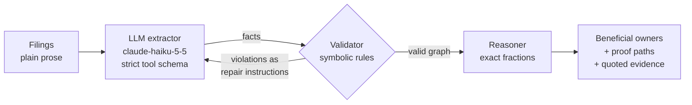
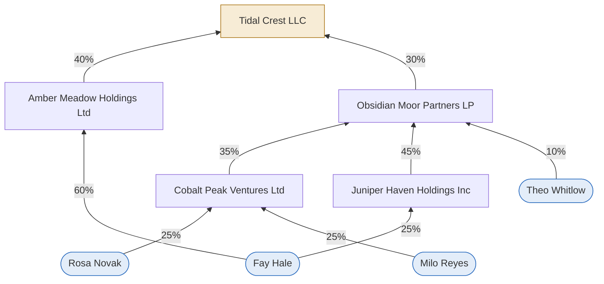

# Ownership Graph: a neurosymbolic MVP

**An LLM reads company filings and extracts ownership facts. Exact symbolic rules check them, send violations back to the LLM to repair, then compute who really owns the company through chains of holding companies.**

The question it answers: *which individuals own 25% or more of a company, directly or indirectly?* (the usual "beneficial owner" test). The answer has to be exact, since 24.9% and 25% are different legal answers, and auditable: every number should trace back to a sentence in a filing.



For a step-by-step walkthrough of the methodology, following one scenario from generation to evaluation, see [METHODOLOGY.md](METHODOLOGY.md). For the architecture diagrams, the data at each step, and exactly when the Claude API is called, see [ARCHITECTURE.md](ARCHITECTURE.md).

The **neural** part does what LLMs are good at: reading messy language ("acquired 7,000 of the 10,000 outstanding shares", "the remaining interest is held by…"). The **symbolic** part does what LLMs are unreliable at: exact multiplication through chains, consistency checks, and an answer you can audit.

---

## Results

64 synthetic scenarios (ownership depth 1–4 × easy/hard filings × 8 seeds), `claude-haiku-5-5`, compared against an LLM-only baseline that gets the same filings and is asked for the answer directly.

| Method | Beneficial-owner set exactly right | Set F1 | Mean abs. error of effective % |
|---|---|---|---|
| Neurosymbolic pipeline | **100%** (64/64) | 1.00 | 0.000 pts (exact) |
| LLM only | **100%** (64/64) | 1.00 | 0.003 pts (rounding) |


**What this means, in plain language:**

- **On this dataset, the two methods tie on accuracy.** Haiku 5.5 got every answer right on its own, including the traps: people at exactly 24% (correctly excluded), people at exactly 25% (correctly included), and owners who only cross 25% by adding two separate paths (e.g. 24% + 3.375% = 27.375%). The synthetic filings, even the "hard" ones, are **not hard enough to separate the methods** for this model. This is a ceiling effect, not proof that the rules add nothing.
- **Extraction was perfect, so the repair loop never fired.** All 64 first-pass extractions matched the ground truth exactly (edge precision, recall and F1 all 1.00), with zero rule violations. The repair loop is tested end to end with an injected error (`tests/test_pipeline.py`), but it hasn't yet been exercised by a real model mistake.
- **Where the pipeline is still different:**
  - *Exactness.* The baseline rounds (27.375% → "27.4", 25 11/15% → "25.7"). Here that never flipped a decision, but an LLM rounding 24.96% to "25" would. The pipeline's arithmetic is exact `Fraction`s, so threshold checks can't drift.
  - *Auditability.* Every pipeline answer comes with proof paths and the quoted sentence behind each hop (see `show` below). The baseline gives a name and a number with no trail.
  - *Checkability.* The pipeline's intermediate output (the graph) can be validated by rules; the baseline's final answer can't.

**Next step to make the comparison meaningful:** harder data. Longer chains (5+ hops), more owners per company, stakes that change over time ("previously held 40%, sold half"), cross-holdings, conflicting statements across documents, and noisier names. Or a smaller local model through `OllamaExtractor`. See [Next steps](#next-steps).

Full tables: [`results/results.md`](results/results.md). Raw per-scenario logs: `results/runs/` (every pipeline round) and `results/baseline/`.

---

## Example: one hard, depth-3 scenario

`python -m ownership.cli show d3_hard_00` prints the true graph, the filings, and the pipeline's answer. Fay Hale is the planted **multi-path** owner: her largest single path is only 24%.

```
Tidal Crest LLC  (target)
├── Amber Meadow Holdings Ltd owns 40%  [company]
│   └── Fay Hale owns 60%  [person]
└── Obsidian Moor Partners LP owns 30%  [company]
    ├── Cobalt Peak Ventures Ltd owns 35%  [company]
    │   ├── Milo Reyes owns 25%  [person]
    │   └── Rosa Novak owns 25%  [person]
    ├── Juniper Haven Holdings Inc owns 45%  [company]
    │   └── Fay Hale owns 25%  [person]
    └── Theo Whitlow owns 10%  [person]
```

Pipeline answer, with evidence for every hop:

```
- Fay Hale: 27.375%  (BENEFICIAL OWNER)
    path 60% x 40% = 24%
      Fay Hale -> Amber Meadow Holdings Ltd 60%   [doc1] "Amber Meadow Holdings Ltd is three-fifths-owned by Fay Hale."
      Amber Meadow Holdings Ltd -> Tidal Crest LLC 40%   [doc1] "Amber Meadow Holdings Ltd holds 400 of the 1,000 outstanding shares of Tidal Crest LLC."
    path 25% x 45% x 30% = 3.375%
      Fay Hale -> Juniper Haven Holdings Inc 25%   [doc1] "Juniper Haven Holdings Inc is one-quarter-owned by Fay Hale."
      Juniper Haven Holdings Inc -> Obsidian Moor Partners LP 45%   [doc1] "Obsidian Moor Partners LP is 45%-owned by Juniper Haven Holdings Inc."
      Obsidian Moor Partners LP -> Tidal Crest LLC 30%   [doc1] "Tidal Crest LLC is 30%-owned by Obsidian Moor Partners LP."
Below threshold: Theo Whitlow 3%, Rosa Novak 2.625%, Milo Reyes 2.625%
```

The filings also name three directors who own nothing (e.g. "Milo Hale serves as chair of the board of Tidal Crest LLC"), which the extractor correctly left out.



---

## Design

### The ontology (`ownership/ontology.py`)

The whole world is two entity types and one relation:

| Concept | Fields |
|---|---|
| `Entity` | `id`, `name`, `type` (`"person"` or `"company"`) |
| `Edge` (ownership) | `owner`, `owned`, `percent`, plus `evidence` (`doc_id`, `quote`) |

Every percentage is a `fractions.Fraction`. "One-third" is stored as exactly `100/3`, not `33.333…`, and products along chains stay exact, so `>= 25` is a true comparison, not a floating-point guess. Fractions are written to JSON as strings like `"249/10"` so they round-trip exactly.

### The validator (`ownership/validator.py`)

`validate(entities, edges)` returns a list of plain-English violations, each ending with an instruction. These are sent straight back to the LLM:

| Rule | Example message |
|---|---|
| People cannot be owned | "Dana Reyes is a person and cannot be owned, but is listed as 30% owned by Acme Holdings LLC. Stakes are only held in companies; re-read the filings and correct this fact." |
| 0 < percent ≤ 100 | "Beta LLC's stake in Gamma Inc is listed as 0%. A stake must be more than 0% and at most 100%; …" |
| Named stakes in a company total ≤ 100% | "Gamma Inc's listed owners total 130%: Beta LLC 70%, Acme Holdings 60%. Re-read the filings and correct these stakes." |
| No entity owns itself | "Gamma Inc is listed as owning 5% of itself. …" |
| Every edge refers to a known entity | "A 5% stake refers to unknown entity 'ghost'. …" |

The pipeline adds three checks of its own when it turns facts into a graph: a name that appears in no filing, an unreadable percent, and the same stake listed twice.

### The reasoner (`ownership/reasoner.py`): two methods

**1. Path method (gives the proof).** Walk every path from a person to the target, multiply the stakes along each path, and add the paths up:

```
Dana → Acme (60%) → Beta (50%) → Gamma (70%)   0.6 × 0.5 × 0.7 = 21%
Dana → Acme (60%) → Gamma (10%)                0.6 × 0.1       =  6%
                                               Dana's total    = 27%
```

**2. Matrix method (the cross-check).** Put direct stakes in a matrix `O`, where `O[i][j]` is the fraction of `j` that `i` owns directly. Then

```
total = (I − O)⁻¹ − I
```

This works because `(I − O)⁻¹ = I + O + O² + O³ + …` and `Oᵏ[i][j]` is the sum of all `k`-hop path products from `i` to `j`. Subtracting `I` leaves paths of every length. The inverse uses a short **exact Gauss–Jordan** routine over `Fraction`s, because `numpy.linalg.inv` works in floats and would break the exact threshold. numpy is used only in a test that checks the two agree. On acyclic graphs the two methods give identical answers (tested on 50 random scenarios). With cross-holdings, the matrix method also counts paths that loop around a cycle, so it's the one used for totals.

`beneficial_owners(target, threshold=25%)` returns every person at or above the threshold, with their proof paths.

### The repair loop (`ownership/pipeline.py`)

```
facts = extract(filings)
repeat up to 2 times:
    graph, violations = build_graph(facts) + validate(graph)
    if no violations: break
    facts = extract(filings, feedback = previous facts + violation messages)
reason over the final graph → beneficial owners, proof paths, evidence
```

The repair prompt shows the model its previous output and the exact violation messages, then asks for the complete corrected list. Every round (facts and violations) is logged to `results/runs/<model>/<scenario>.json`, so you can see what the model got wrong and whether it fixed it.

### The extractor (`ownership/extractor.py`)

- **`ClaudeExtractor`** (default model `claude-haiku-5-5`) uses tool use with a **strict JSON schema** (`strict: true`, `additionalProperties: false`), so the output always has the fact shape `{owner, owner_type, owned, percent, doc_id, quote}`. The prompt says:
  - extract current stakes only;
  - directors and officers are not owners unless a stake is stated;
  - convert share counts, fractions and remainders to percents;
  - quote the source sentence;
  - use full names.

  `tool_choice` is left on `auto` with the prompt telling the model to call the tool, because forcing a specific tool returns a 400 on some current models (e.g. `claude-opus-5-5`). That keeps `--model` swappable.
- **`OllamaExtractor`** has the same interface and uses a local model through Ollama's JSON-schema output (`--model ollama:<name>`). It's implemented but wasn't run here, since Ollama isn't installed.
- **`FakeExtractor`** returns the true facts for tests, and can inject an over-100% error or a misread director on the first call.
- **Caching:** every LLM response is saved under `results/cache/` (gitignored), keyed by a hash of the model and the full prompt. Reruns are free and give identical results.
- **Name matching:** names are normalised (case, punctuation, `L.L.C.`→`llc`, `Incorporated`→`inc`, a leading "The") before matching.

### The LLM-only baseline (`ownership/baseline.py`)

Same model, same filings, one question: *"Which individuals own 25% or more of \<target\>, directly or indirectly? Give each person's effective percentage."* It gets a structured `[{person, percent}]` answer, with no rules, no graph and no repair.

---

## The synthetic data

### Generator (`ownership/generator.py`)

Each scenario is people at the top, layers of holding companies, and one target company at the bottom. Owners only point to a **lower** layer, so the graph is acyclic and `depth` (1–4) is exactly the longest chain. Stakes into each company total at most 100%; any remainder belongs to unnamed "other shareholders". Names are fictional ("Cobalt Meadow Holdings LP", "Dana Reyes"). Everything is deterministic per seed.

Each scenario also **plants** one interesting owner, rotating through:

| Case | What it tests |
|---|---|
| `multi_path` | crosses 25% **only** by adding two paths; every single path is below 25% |
| `exact_25` | exactly 25%, which must count |
| `near_24` | exactly 24%, which must not count |
| `above` / `below` | clearly 40–60% / 5–15% |

The planted stake is solved for (stake = wanted share ÷ the company's effective share in the target), then checked with the reasoner. The manifest flags (`has_multi_path_owner`, `has_near_threshold_owner`) are computed from the result, never assumed. Of the 64 scenarios, 12 have a multi-path owner and 39 a near-threshold owner.

### Renderer and difficulty levels (`ownership/renderer.py`)

Each scenario becomes 1–3 short filings. Every edge is stated **exactly once**, and the renderer records the doc id, sentence index and text. That's the extraction ground truth and the evidence trail.

| Level | Phrasings |
|---|---|
| **easy** | Direct percents, owner as subject: "Beta LLC holds a 70% stake in Gamma Inc." / "Beta LLC owns 70% of Gamma Inc." / "Beta LLC is the holder of 70% of the outstanding shares of Gamma Inc." |
| **hard** | Passive: "Gamma Inc is 70%-owned by Beta LLC." · Fractions: "Fay Hale owns one-third of Gamma Inc." · Share counts: "Beta LLC holds 7,000 of the 10,000 outstanding shares of Gamma Inc." · Remainders: "Of the shares of Gamma Inc, Beta LLC holds 70%; the remaining interest is held by Eli Park." |

Both levels add **distractors**: founding dates, registered addresses, and **directors and officers who own nothing**. Officer sentences are placed right next to real ownership sentences, so an extractor that treats every named person as an owner gets caught. Tests check that every share-count and fraction phrasing round-trips to the exact percent.

### Files per scenario

```
data/
├── manifest.jsonl                 one line per scenario: id, depth, difficulty, case,
│                                  n_entities, n_edges, n_docs, multi-path/near-threshold flags
└── scenarios/d3_hard_00/
    ├── filings/doc1.txt …         the prose the LLM reads
    └── truth.json                 entities, edges with evidence, statements, officers,
                                   effective ownership + proof paths, beneficial owners
```

`data/` is gitignored. Regenerate it with `generate` (it's deterministic).

---

## How to run it

From this folder, using the repo's virtual environment (`..\.venv`). Python 3.11+ with `numpy`, `matplotlib`, `pytest` and `anthropic`.

```powershell
# 1. Build the dataset (no API calls)
..\.venv\Scripts\python -m ownership.cli generate --n 64 --seed 0

# 2. Tests (no API calls)
..\.venv\Scripts\python -m pytest -q

# 3. API key: set it in your own terminal, never in code
setx ANTHROPIC_API_KEY <your key>          # then open a new terminal
# (if your key isn't scoped to a workspace, also: setx ANTHROPIC_WORKSPACE_ID wrkspc_...)

# 4. Run the pipeline and the baseline. Each prints how many LLM calls it will make first.
..\.venv\Scripts\python -m ownership.cli run --model claude-haiku-5-5            # add --limit N or --ids a,b
..\.venv\Scripts\python -m ownership.cli baseline --model claude-haiku-5-5

# 5. Score both methods -> results/results.md and results/accuracy_by_depth.png
..\.venv\Scripts\python -m ownership.cli evaluate

# Inspect one scenario: tree, Mermaid diagram, filings, true answer, pipeline answer
..\.venv\Scripts\python -m ownership.cli show d3_hard_00
```

The full run is 128 calls on `claude-haiku-5-5` (64 extractions + 64 baseline answers; no repairs were needed), which costs a few cents. Because responses are cached, rerunning costs nothing.

### Tests (`tests/`, 35 tests, no network)

- **Reasoner:** the spec's worked example (Dana 27% = 21% + 6%, Eli 35%, Fay 20%; beneficial owners Dana and Eli); exactly-25% vs 24.99%; path method = matrix method on 50 random scenarios; cross-holdings; singular loops; exact vs numpy.
- **Validator:** clean on all generated scenarios, plus one deliberately corrupted case per rule.
- **Generator and renderer:** determinism, depth = longest chain, planted cases present, every edge stated once at its recorded sentence, share-count and fraction round-trips, officers never owners.
- **Pipeline:**
  - end to end with `FakeExtractor`, including an over-100% error that the repair round fixes;
  - name normalisation;
  - Claude output parsing and caching with a stubbed client;
  - re-asking when the model doesn't call the tool;
  - evaluation end to end.

---

## Next steps

1. **Harder data, so the comparison means something:** 5+ hop chains, more owners per company, historical changes where only the current stake counts, cross-holdings, conflicting statements across documents, misspelled or abbreviated names.
2. **A weaker or local extractor** (`--model ollama:<name>`) to see the repair loop do real work.
3. **Real filings:** swap the synthetic renderer for actual documents; the ontology, validator and reasoner don't change.
