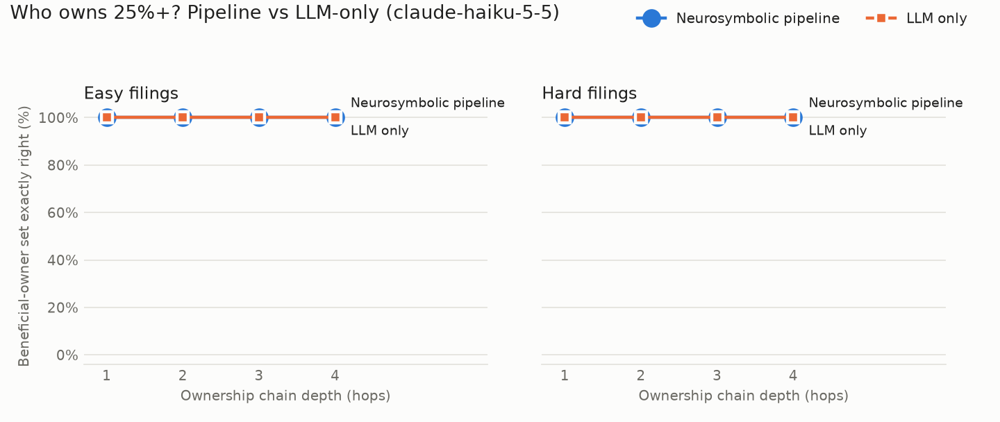

# Results (claude-haiku-5-5)

64 scenarios. Beneficial owner = an individual with 25% or more, directly or indirectly.

## Overall

| Method | Scenarios | BO exact match | BO set F1 | MAE of effective % (true owners) |
|---|---|---|---|---|
| Neurosymbolic pipeline | 64 | 100% | 1.00 | 0.00 pts |
| LLM only | 64 | 100% | 1.00 | 0.00 pts |

## Beneficial-owner exact match by depth

| Difficulty | Method | Depth 1 | Depth 2 | Depth 3 | Depth 4 |
|---|---|---|---|---|---|
| easy | Neurosymbolic pipeline | 100% | 100% | 100% | 100% |
| easy | LLM only | 100% | 100% | 100% | 100% |
| hard | Neurosymbolic pipeline | 100% | 100% | 100% | 100% |
| hard | LLM only | 100% | 100% | 100% | 100% |

## Full breakdown

| Method | Difficulty | Depth | n | BO exact | BO F1 | MAE (pts) | Edge P | Edge R | Edge F1 |
|---|---|---|---|---|---|---|---|---|---|
| LLM only | easy | 1 | 8 | 100% | 1.00 | 0.00 | – | – | – |
| LLM only | easy | 2 | 8 | 100% | 1.00 | 0.00 | – | – | – |
| LLM only | easy | 3 | 8 | 100% | 1.00 | 0.01 | – | – | – |
| LLM only | easy | 4 | 8 | 100% | 1.00 | 0.01 | – | – | – |
| LLM only | hard | 1 | 8 | 100% | 1.00 | 0.00 | – | – | – |
| LLM only | hard | 2 | 8 | 100% | 1.00 | 0.00 | – | – | – |
| LLM only | hard | 3 | 8 | 100% | 1.00 | 0.00 | – | – | – |
| LLM only | hard | 4 | 8 | 100% | 1.00 | 0.00 | – | – | – |
| Neurosymbolic pipeline | easy | 1 | 8 | 100% | 1.00 | 0.00 | 1.00 | 1.00 | 1.00 |
| Neurosymbolic pipeline | easy | 2 | 8 | 100% | 1.00 | 0.00 | 1.00 | 1.00 | 1.00 |
| Neurosymbolic pipeline | easy | 3 | 8 | 100% | 1.00 | 0.00 | 1.00 | 1.00 | 1.00 |
| Neurosymbolic pipeline | easy | 4 | 8 | 100% | 1.00 | 0.00 | 1.00 | 1.00 | 1.00 |
| Neurosymbolic pipeline | hard | 1 | 8 | 100% | 1.00 | 0.00 | 1.00 | 1.00 | 1.00 |
| Neurosymbolic pipeline | hard | 2 | 8 | 100% | 1.00 | 0.00 | 1.00 | 1.00 | 1.00 |
| Neurosymbolic pipeline | hard | 3 | 8 | 100% | 1.00 | 0.00 | 1.00 | 1.00 | 1.00 |
| Neurosymbolic pipeline | hard | 4 | 8 | 100% | 1.00 | 0.00 | 1.00 | 1.00 | 1.00 |

## Extraction and repair (pipeline only)

- Edge extraction: precision 1.00, recall 1.00, F1 1.00 (match = same owner, same owned company, percent within 0.01).
- Violations found by the validator across all rounds: 0.
- Scenarios whose first extraction broke a rule: 0 of 64; the repair loop made 0 of them valid.
- easy: edge F1 1.00, initially invalid 0, repaired 0.
- hard: edge F1 1.00, initially invalid 0, repaired 0.

